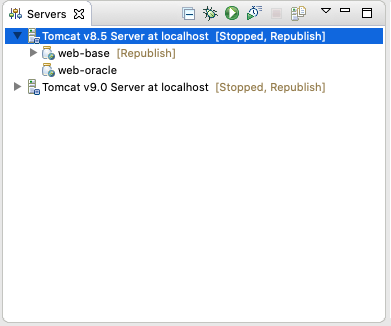
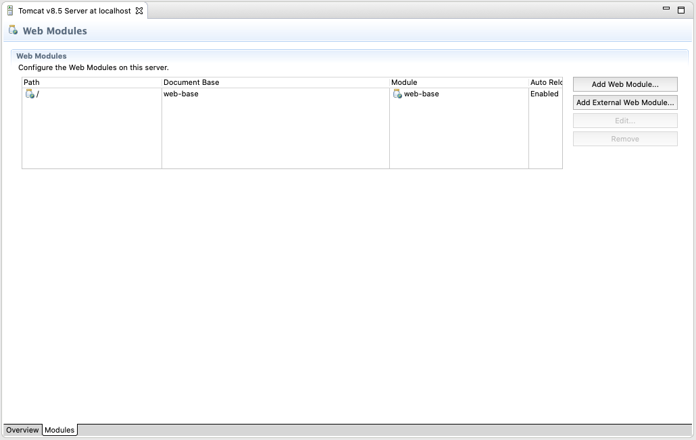
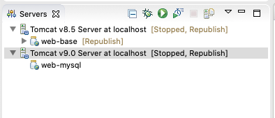
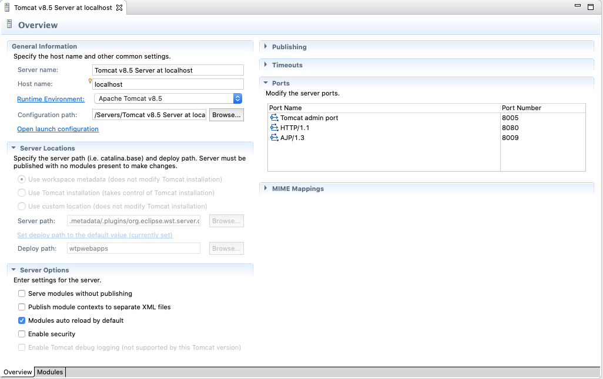
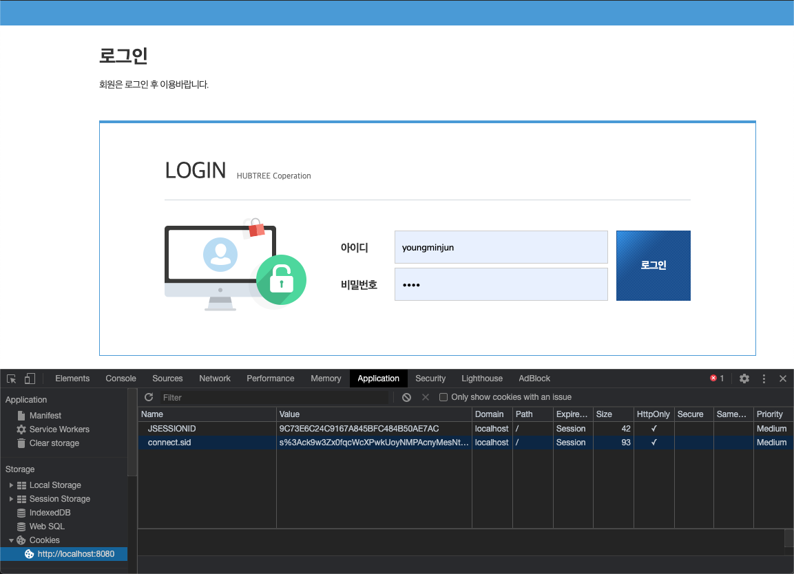
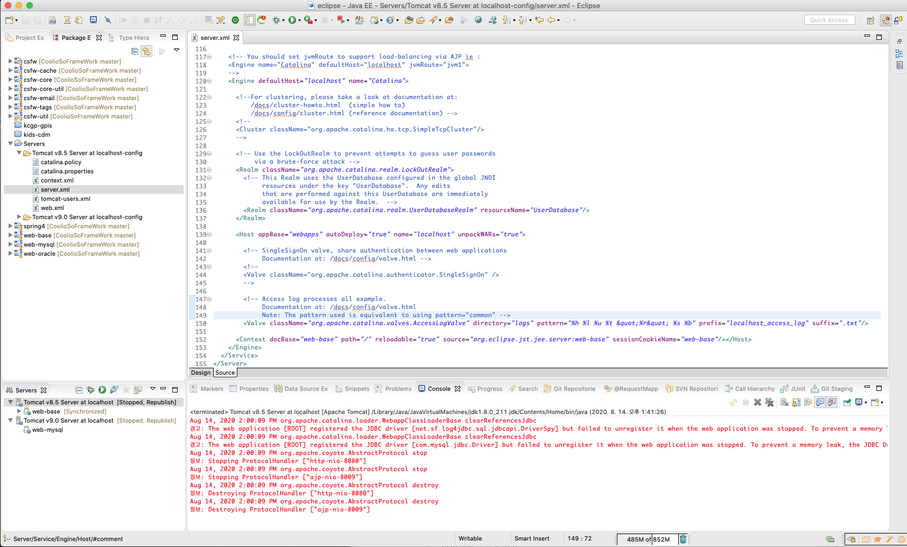
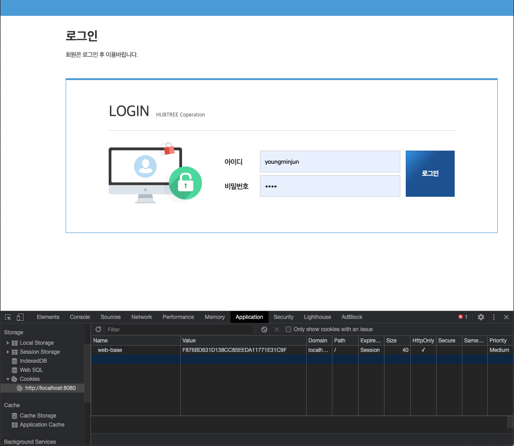

> 프로젝트 진행시에 하나의 `Eclipse`에서 다중 프로젝트를 구성하여 동시에 실행해야 할 때가 있다.  
> 이때는 보편적으로 다음 중 하나의 방법을 통해서 구성할 수 있다.

1. WAS의 Context를 활용한 다중 프로젝트 구성
2. WAS의 Port를 활용한 다중 프로젝트 구성

## WAS의 Context를 활용한 다중 프로젝트 구성

> 하나의 WAS의 `Web Project`를 여러개 추가해서 구성하는 방법


### Context란?

> WAS에서 WebApps를 배포할 웹 애플리케이션의 `WAR` 파일을 복사해서 WAS를 구동하면 해당 `WAR`의 파일명으로 URL을 입력하여 접근할 수 있다.  
> 이렇게 접근할 수 있는 `WAR`의 파일명으로 접근할 수 있는 하나의 웹 애플리케이션을 `Context`라고 한다.

{: .normal}


#### Context 경로 변경 방법

> 서버의 Modules 정보에서 해당 프로젝트의 `Path`를 변경하면 Context 경로가 변경된다.

{: .normal}

### 접근 방법

```
web-base 프로젝트 : 
    - http://localhost:8080/web-base

web-oracle 프로젝트 :
    - http://localhost:8080/web-oracle
```

### 문제점

> Context의 경로가 개발시에 사용되는 URI에 선언되어 있지 않으면 해당 URI에 대한 접근이 불가능하다.
> 그래서 개발시에는 해당 Context의 정보를 `/`를 보편적으로 활용해서 개발을 하고 있다.
>
> 하지만 운영되는 WAS에서 기존의 다른 프로젝트가 `/`를 사용하고 있다면 context에 대한 변경이 필요하다.
> 해당 context 변경시에 해당 선언에 대한 포함여부를 고려하지 않았다면 모든 URI 주소에서 context에 대한 선언을 추가하는 작업이 소요된다.


## WAS의 Port를 활용한 다중 프로젝트 구성

> Eclipse에서 WAS를 여러개 구성하여 해당 WAS의 접속하는 포트를 변경하여 다중 프로젝트를 구성하는 방법

{: .normal}


### WAS의 포트 변경 방법

> 서버의 설정 정보에서 다음의 정보를 변경한다.

- Tomcat admin port
- HTTP/1.1
- AJP/1.3

{: .normal}


### 접근 방법

```
web-base 프로젝트 : 
    - http://localhost:8080/

web-oracle 프로젝트 :
    - http://localhost:8090/
```


### 문제점

> Tomcat에서 stateless에 대한 문제를 해결하기 위해서 사용하는 `JSESSIONID` 값의 문제로 동시에 프로젝트를 실행 했을 경우에 서로의 `JSESSIONID` 값을 조작하여 세션값에 대한 연결 상태를 해지하는 문제가 발생한다.  
> `Session`에 정보를 저장하는 로그인을 하고 다른쪽에서 동일한 로그인을 할 경우에는 양쪽 모두 `JSESSIONID`값의 변경으로 인해서 모두 연결이 해지됨

#### JSESSIONID란

- 톰캣 컨테이너에서 세션을 유지하기 위해 발급하는 키
- HTTP 프로토콜은 stateless하기 때문에 요청시마다 새로운 연결이 생성되고 응답후 연결은 끊기게 되므로 상태를 유지할 수 없다.
- 따라서, 상태를 저장하기 위해서 톰캣은 JESSESIONID 쿠키를 클라이언트에게 발급해주고 이 값을 통해 세션을 유지할 수 있도록 한다.

{: .normal}

### 해당 문제에 대한 해결 방법

> Eclipse 서버에 구성되어 있는 WAS의 server.xml에서 context 부분의 `sessionContextName`을 지정하여 동일한 `JSESSIONID`를 키값으로 활용하여 서로 초기화하는 문제를 해결

#### 해결방법

```
Eclipse의 Servers > Tomcat x.x config > server.xml
```

{: .normal}

⁠

```xml
<Host ...>
  <Context docBase="web-base" path="/" reloadable="true" source="org.eclipse.jst.jee.server:web-base" sessionCookieName="web-base"/>
</Host>
```


#### JSESSIONID값 변경 후 정보

{: .normal}