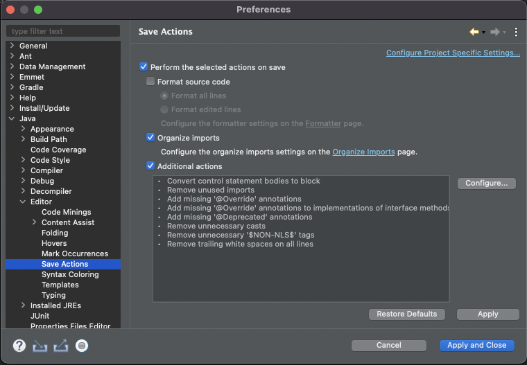
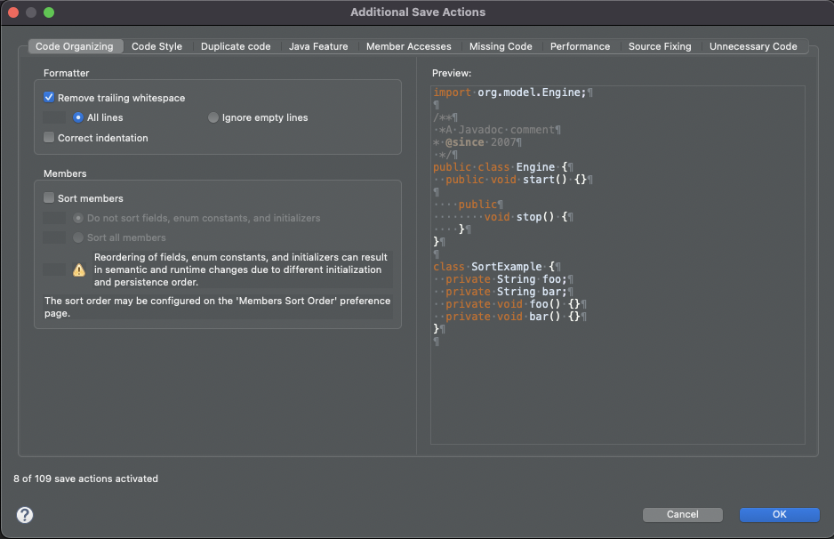
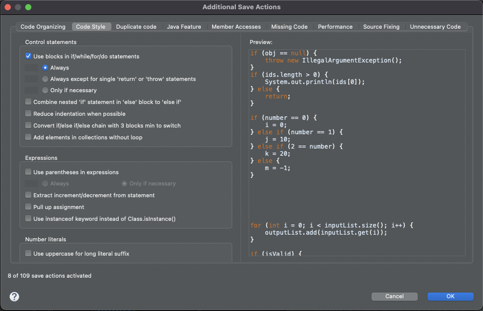
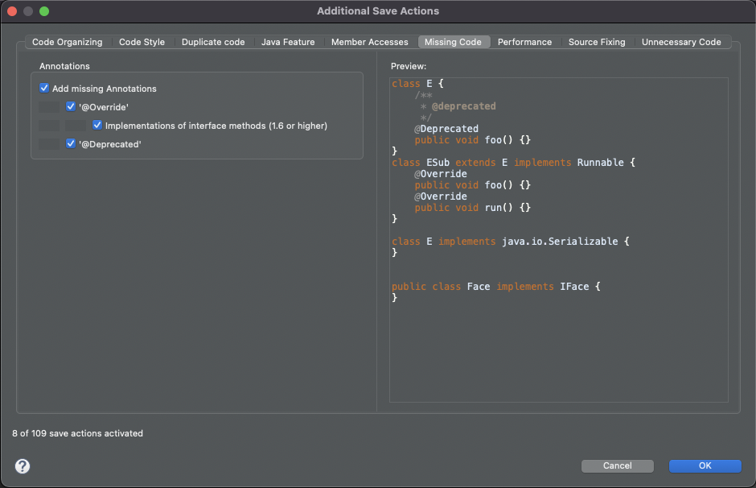
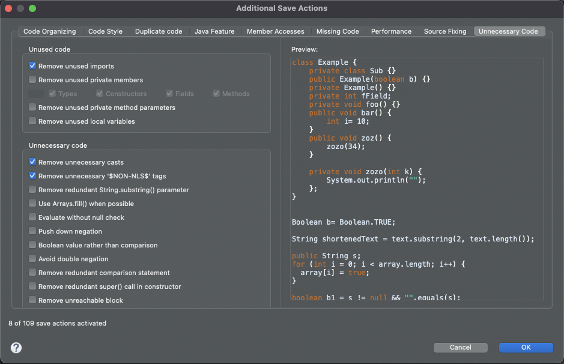

## Java Save Actions 설정

> 자바 코드 수정 후에 저장시에 자동으로 지정된 액션을 수행한다.
>
> 불필요한 코드 및 코드 포맷에 대한 일치화를 위한 작업

 

### Save Actions 활성화

`Preferences > Java > Editor > Save Actions`

1. `Perform the selected actions on save` 체크

2. `Addtional actions` 체크
- 저장시에 추가적인 액션에 대한 정의

{: .normal}

#### Code Organizing

- Formatter 설정
  - 공백 제거 : `Remove trailing whitespace > All lines`
  - 들여쓰기 : `Correct indentation`

{: .normal}

#### Code Style

- Control statements 설정
  - 블록 구분자 : `Use blocks in if/while/for/do statements > Always`

{: .normal}

#### Missing Code

- Annotations

  - 어노테이션 추가 : `Add missing Annotations`

    - `@Override`
    - `@Deprecated

{: .normal}

#### Unnecessary Code

- Unused code
  - 불필요한 Imports 제거 : `Remove unused imports`
- Unnecessary code
  - 불필요한 Cast 제거 : `Remove unnecessary casts`
  - 불필요한 `$NON-NLS$` 태그 제거 : `Remove unnecessary '$NON-NLS$' tags`

{: .normal}