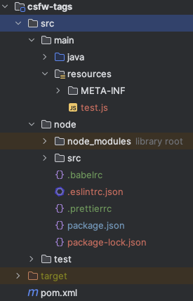

## 프로젝트의 Node 관련 폴더 생성

#### 프로젝트 구조

- B/E 프로젝트 : `/src/main`
- F/E 프로젝트 : `/src/node`

{: .normal}

## NPM 초기화

1. 프로젝트가 열려있는 `Node`  폴더에서 `Terminal` 혹은 `cmd`를 켜고 `npm init`을 입력합니다.

   - 쭉 내려오는 질문들에 적절한 답을 적고 (따로 적을 필요가 없다면 쭉 엔터를 누르다가 마지막에 `yes`를 입력하시면 됩니다.)

2. 프로젝트의 루트에 `package.json`이 생성되었는지 확인합니다.


## Babel 설치

1. Babel 관련 라이브러리 설치

   - `npm i --save-dev @babel/core @babel/cli @babel/preset-env`

2. npm으로 `@babel/core`, `@babel/cli`, `@babel/preset-env`를 설치한다는 뜻

   - `--save-dev`라는 옵션은 `package.json` 내에 빌드시 포함되지 않는 플러그인이 들어가는 `devDependencies` 객체 안에 저장되게 한다는 뜻입니다.

3. 루트에 `.babelrc` 파일을 생성

4. `.babelrc` 파일 안에 presets를 세팅
   
   - `targets` 옵션은 지원하는 브라우저를 세팅. 
```
   {
      "presets": [
         [
         "@babel/preset-env",
         {"targets": "> 5%, Firefox > 1, last 2 versions"}
         ]
      ]
   }
```
5. `package.json`으로 가서 `scripts`안에 있는 코드에 다음 코드를 추가
   
   - `"babel": "babel src/main/resources/static/es6 -d src/main/resources/static -w"`
   - `"babel"`은 npm run 뒤에 올 명령어
   - `src/main/resources/static/es6`는 트랜스파일링 전 ES6 js 파일이 들어있는 폴더의 위치
   - `-d` 옵션으로 파일로 `ouput`을 지정하여 트랜스파일링한 파일을 `src/main/resources/static`에 저장
   - 매번 `npm run babel`을 하기 귀찮으니 `-w` 옵션으로 파일이 save될 때마다 `npm run babel`을 실행


## Prettier 설치

1. Prettier 라이브러리 설치

   - `npm i --save-dev -save-exact prettier`
   - `--save-exact` 옵션을 적용하면 package.json에서 version에 `^`가 없이 적히게 되는데 이는 자동 버전 업데이트로 인한 오류를 방지하기 위해 버전을 고정시키는 옵션

2. 루트에 `.prettierrc` 파일을 생성

```
{
   "trailingComma": "es5",
   "tabWidth": 2,
   "semi": true,
   "singleQuote": true
}
```


## ESLint 설치

1. ESLint 라이브리러 설치

   - `npm i --save-dev eslint`

2. `eslint --init`로 eslint 설정파일을 생성
   ```
   How would you like to use ESLint?
   > To check syntax, find problems
   What type of modules does your project use?
   > Javascript modules
   Which framework does your project use?
   > None of these
   Where does yoru code run?
   > Browser
   What format do you want your config file to be in?
   > JSON
   ```
   - 아래로 나오는 질문들에는 방향키로 선택한 후 엔터를 누르면 됩니다.
   - 각자 맞는 세팅에 따라 선택해주시되, **첫번째 질문은 2번을 선택해주세요**

3. babel과 eslint를 함께 사용하기 위한 `babel-eslint`파서를 설치

   - `npm i --save-dev babel-eslint`

4. `eslint`와 `prettier`의 속성이 겹치며 오류가 발생하는 케이스가 있어 이를 방지하기 위해 `eslint-config-prettier`를 설치

   - `npm i --save-dev eslint-config-prettier`

5. 루트에 있는 `.eslintrc.json` 파일에 있는 extends를 아래와 같이 수정

   - `"extends": ["eslint:recommended", "plugin:prettier/recommended"]`

6. `"parser": "babel-eslint"` 를 추가

7. `rules`에는 `ESLint` 규칙이, `ignorePattenrs`에는 `ESLint`를 돌리지 않을 파일들을 설정할 수 있음


## 완성본

```
{
   "parser": "babel-eslint",
   "env": {
       "browser": true,
       "es2021": true
  },
   "extends": ["eslint:recommended", "plugin:prettier/recommended"],
   "parserOptions": {
       "ecmaVersion": "latest",
       "sourceType": "module"
  },
   "ignorePatterns": ["../main/resources"],
   "rules": {
       "no-var": "warn",
       "no-unused-vars": "warn",
       "prefer-const": "off",
       "prettier/prettier": [
           "warn",
          {
               "endOfLine": "auto"
          }
      ]
  }
}
```


## 테스트

### 샘플 코드

```
let a = 1;
let b = () => {return 'hello'};
let c = [1,2,3,4].map(e => {return e*e});
let obj = {a, b}
```


### 변환결과

- arrow function이 일반 function으로 변경
- 간소화된 Object도 Key와 Value가 따로 각각 들어가는 ES5 형태로 변경

```js
"use strict";

var a = 1;
var b = function b() {
	return 'hello';
};
var c = [1, 2, 3, 4].map(function (e) {
	return e * e;
});
var obj = {
	a: a,
	b: b
};
```
